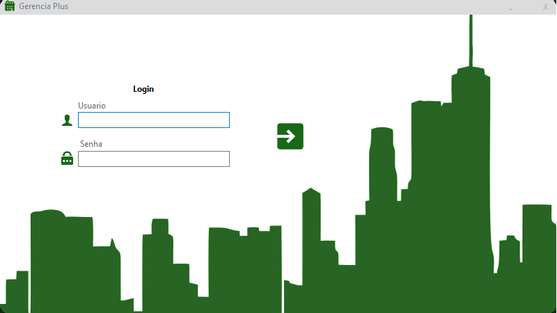

<h1 align="center"> Sistema de Gestão Auxiliar para Condominios 🏠</h1>

    

 <a href="#status">Status</a> • 
 <a href="#objetivo">Objetivo</a> •
 <a href="#installation">Instalação</a> • 
 <a href="#tecnologia">Tecnologia</a> • 
 <a href="#autor">Autor</a> •
 <a href ="#creditos"> Créditos</a> •
 <a href="#license">License</a>

<h2 align="center" id=status> 
	⏳ Em desenvolvimento ⏳
</h2>

<h2 id=objetivo>📜 Sobre</h2>
Sistema de Gestão Auxiliar para Condominios. 
Usado SDK .NET 8.0.

Nuget API
~~~
https://api.nuget.org/v3/index.json
~~~

Exemplo de conexão para MySQL:
~~~
string connectionString = "server=localhost;port=3306;database=SEU_BANCO;uid=SEU_USER;password=SUA_SENHA";
~~~

Exemplo de conexão para MsSQL:
~~~
string connectionString = @"Data Source="SEU SERVER"\SQLEXPRESS;Initial Catalog=sgc;Integrated Security=True;";
~~~

<h2 id=installation>✔️ Instalação</h2>

1. Clone o repositório.
2. Execute os arquivos dentro da pasta sql_script.
3. Debugue o projeto.

<h2 id=tecnologia>🧰 Tecnologia</h2>

As ferramentas a seguir estão sendo usadas para o desenvolvimento do projeto:

- IDE: <a href="https://visualstudio.microsoft.com/pt-br/free-developer-offers/">Visual Studio 2022 Community Edition</a>
- MySQL: <a href="https://www.mysql.com/">MySQL Workbench</a>
- MsSQL: <a href = "https://www.microsoft.com/pt-br/sql-server/sql-server-downloads"> MsSQL Server</a>

<h2 id=autor>😎 Autor</h2>

Desenvolvido por <a href="https://www.linkedin.com/in/jeancarll/" target="_blank">Jean Carlos</a>

<h2 id= creditos>✨Créditos</h2>
Referencia para o README e o código de algoritmo de conexão com a database:  
<a href="https://github.com/danhpaiva/example-csharp-database-202302-01/edit/main/README.md"> README de referencia </a>  
<a href="https://github.com/danhpaiva/example-csharp-database-202302-01"> Algoritmo de conexão com a database usado de referencia </a>  
<a href="https://github.com/danhpaiva"> Github do Autor do código pego de referencia </a>

<h2 id=license>🆓 Licença</h2>
Veja a licença para esse projeto.  
<a href="https://github.com/JeanCarlos0111/sistema-gerenciamento-condominio/blob/main/LICENSE" target="_blank">MIT</a>
